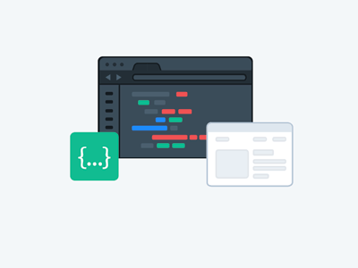

# 👋 Olá, bom ter você por aqui!
  

  

Sou programador, estudante da carreira Full-Stack e de bancos de dados.

- 💻 Estudante de Ciência da Computação
- 👩‍💻 Aprendendo algo sobre front-end e back-end

  &nbsp;
  &nbsp;
  &nbsp;
  &nbsp;

